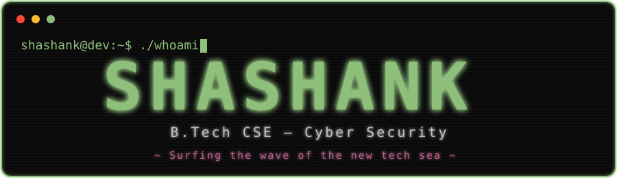

<div align="center">
        





</div>

<p align="center"></p>

```text
╭────────────────────────────────────────────────────────────╮
│  shashank@dev:~$ cat /etc/identity                         │
│                                                            │
│  name      :: SHASHANK D SALIAN                            │
│  degree    :: B.Tech CSE (Cyber Security)                  │
│  email     :: shashankdsalian@gmail.com                    │
│  linkedin  :: see connect below ↓                          │
╰────────────────────────────────────────────────────────────╯
```

## ❯ whoami

```text
╭────────────────────────────────────────────────────────────╮
│  $ cat about.txt                                           │
╰────────────────────────────────────────────────────────────╯
```

Computer Science Engineering student specializing in **Cyber Security**.

I build reliable, efficient, and secure software — from gamified cybersecurity training platforms to post-quantum cryptography benchmarks and full-stack compliance tools.

```text
🔭 Focus     :: Software Engineering · Backend · Security-First Design
🌱 Learning  :: Cloud Security · Scalable Architecture · Applied Crypto
🎯 Goal      :: Software Engineer building defensible systems
🌊 Motto     :: Surfing the wave of the new tech sea
```

<p align="center"></p>

## ❯ neofetch

```text
        .--.                 shashank@dev
       |o_o |                ────────────
       |:_/ |                OS:        macOS · Parrot OS · Kali Linux · Ubuntu
      //   \ \               Focus:     Cyber Security
     (|     | )              Languages: C · Python · JavaScript
    /'\_   _/`\              Backend:   Flask · FastAPI
    \___)=(___/              Frontend:  React 18 · Vite
                             Database:  PostgreSQL · SQLite
                             Theme:     dark / neon-green
```

<p align="center"></p>

## ❯ ls -la ~/skills

```text
╭──────────────────────────────────────────────────────────────╮
│ drwxr-xr-x  languages/   C · Python                          │
│ drwxr-xr-x  backend/     Flask · FastAPI · SQLAlchemy        │
│                          Pydantic · REST APIs · JWT · RBAC   │
│ drwxr-xr-x  frontend/    React 18 · Vite · Axios             │
│ drwxr-xr-x  data/        Pandas · NumPy · Matplotlib         │
│                          Seaborn                             │
│ drwxr-xr-x  security/    Wazuh SIEM · nmap · hydra · hping3  │
│ drwxr-xr-x  crypto/      PyCryptodome · oqs-python (liboqs)  │
│ drwxr-xr-x  databases/   PostgreSQL · SQLite                 │
│ drwxr-xr-x  devops/      Docker · Docker Compose · Git       │
│                          GitHub · Pytest                     │
│ drwxr-xr-x  systems/     Parrot OS · Kali Linux · Ubuntu     │
│                          macOS · VS Code                     │
│                                                              │
│ spoken/     English · Hindi · Kannada                        │
│ soft/       Adaptability · Critical Thinking                 │
│             Problem Solving · Teamwork · Leadership          │
│             Time Management                                  │
╰──────────────────────────────────────────────────────────────╯
```

<p align="center">


</p>

<p align="center"></p>

## ❯ ./cyberrange --status

**CyberRange — Gamified Cybersecurity Training Platform**

```text
╭──────────────────────────────────────────────────────────────╮
│ A Counter-Strike-inspired cyber battle simulator with a      │
│ real-time HUD for Red Team attack simulations and Blue Team  │
│ defensive actions.                                           │
│                                                              │
│ ✔ Live scoring system                                        │
│ ✔ Automated Wazuh SIEM alerts                                │
│ ✔ Network security monitoring                                │
│ ✔ Real-time HUD dashboard                                    │
│                                                              │
│ stack :: Flask-SocketIO · JavaScript/HTML5 · REST APIs       │
│          WebSockets · Kali Linux · Ubuntu · nmap · hydra     │
│          hping3 · Wazuh SIEM · Bash · VMware/VirtualBox      │
│          JSON · Python · Flask                               │
╰──────────────────────────────────────────────────────────────╯
```

<p align="center"></p>

## ❯ ./rsa-vs-kyber --benchmark

**Comparative Performance & Security Evaluation of RSA and Post-Quantum Cryptography**

```text
╭──────────────────────────────────────────────────────────────╮
│ Comparative evaluation of RSA-2048 vs Kyber512 against       │
│ quantum computing threats — security and performance         │
│ benchmarking.                                                │
│                                                              │
│ ✔ Published paper at ICIPTM 2026                             │
│ ✔ Defined comparative parameters & benchmarking metrics      │
│ ✔ Curated evaluation framework                               │
│ ✔ Performance visualization pipeline                         │
│                                                              │
│ stack :: PyCryptodome · oqs-python (liboqs) · Kyber512       │
│          RSA-2048 · Lattice-based crypto (M-LWE) · Pandas    │
│          NumPy · Matplotlib · Seaborn · tracemalloc · psutil │
│          CSV · Git · Python                                  │
╰──────────────────────────────────────────────────────────────╯
```

<p align="center"></p>

## ❯ ./ledgerflow --features

**LedgerFlow — Compliance & Tax-Workflow Platform**

```text
╭──────────────────────────────────────────────────────────────╮
│ Full-stack compliance and tax-workflow platform for small    │
│ CA firms.                                                    │
│                                                              │
│ ✔ Client PAN/GST management                                  │
│ ✔ Income-expense tracking                                    │
│ ✔ Document storage                                           │
│ ✔ Automated deadline reminders                               │
│ ✔ JWT authentication                                         │
│ ✔ Role-based access control                                  │
│                                                              │
│ stack :: React 18 · Vite · React Router · Axios              │
│          Context API · Python 3.12 · FastAPI · SQLAlchemy    │
│          Pydantic · python-jose · passlib · PostgreSQL       │
│          SQLite · JWT · RBAC · REST API · Pytest · Docker    │
│          Git/GitHub                                          │
╰──────────────────────────────────────────────────────────────╯
```

<p align="center"></p>

## ❯ ./connect --all

```text
╭──────────────────────────────────────────────────────────╮
│                                                          │
│  EMAIL     :: shashankdsalian@gmail.com                  │
│  LINKEDIN  ::linkedin.com/in/shashank-d-salian-05ab21324 │
│                                                          │
╰──────────────────────────────────────────────────────────╯
```

<div align="center">

[](https://www.linkedin.com/in/shashank-d-salian-05ab21324/)
[](mailto:shashankdsalian@gmail.com)

</div>

<p align="center"></p>

<div align="center">

```text
❯ cicada --exit

╭─────────────────────────────────────────╮
│  Thanks for visiting.                   │
│                                         │
│        [ cicada drifts away ]           │
│                                         │
╰─────────────────────────────────────────╯

"Surfing the wave of the new tech sea"
```


`❯ cicada --flutter --pixel`

[🔊 `❯ cicada --sound`](./assets/cicada-sound.wav)
</div>
